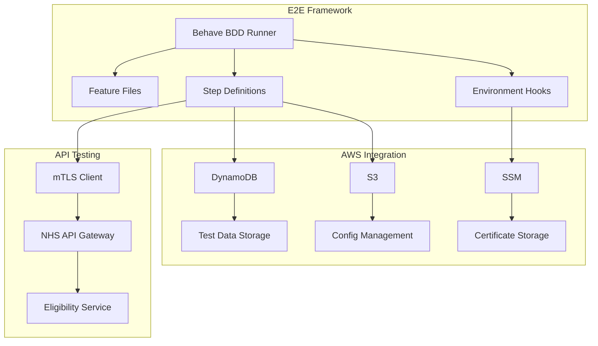
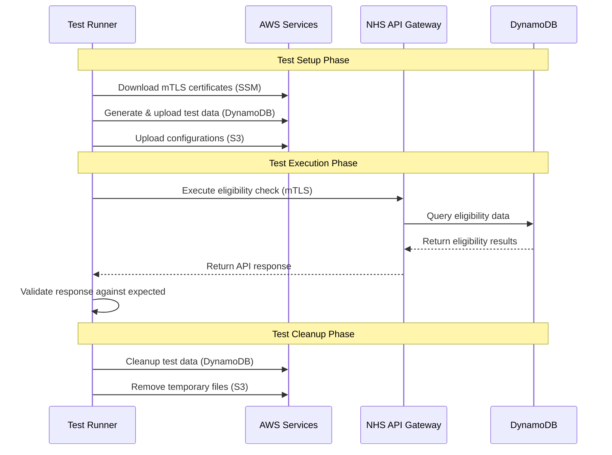

# E2E Test Automation Framework - Technical Handover Documentation

**Document Version**: 1.0
**Last Updated**: January 2025
**Framework Version**: 1.0
**Audience**: QA Engineers, DevOps Engineers, Development Team Leads

---

## 📋 Executive Summary

This document provides technical handover information for the NHS Eligibility Signposting API E2E Test Automation Framework. The framework is production-ready and has been successfully validating API functionality with comprehensive AWS integration.

### Framework Capabilities

- ✅ **Automated BDD Testing** with Behave framework
- ✅ **AWS Cloud Integration** (DynamoDB, S3, SSM)
- ✅ **mTLS Authentication** with automatic certificate management
- ✅ **Dynamic Test Data** generation and cleanup
- ✅ **CI/CD Ready** with Jenkins and GitHub Actions support

### Current Test Coverage

- **14 comprehensive scenarios** covering RSV vaccination eligibility
- **API validation** with schema verification
- **End-to-end workflow** from data setup to cleanup
- **Multi-environment support** (test, staging configurations)

---

## 🏗️ Technical Architecture

### Framework Components



### Key Technologies

| Component       | Technology  | Version | Purpose                 |
| --------------- | ----------- | ------- | ----------------------- |
| BDD Framework   | Behave      | Latest  | Test scenario execution |
| HTTP Client     | Requests    | Latest  | API communication       |
| AWS SDK         | Boto3       | Latest  | AWS service integration |
| Data Processing | Python JSON | 3.13+   | Test data manipulation  |
| Environment     | Poetry      | Latest  | Dependency management   |

### Data Flow Architecture



---

## 🔧 Implementation Details

### Directory Structure and Responsibilities

```
tests/e2e/
├── features/
│   ├── eligibility_check/
│   │   └── eligibility_check.feature      # 📝 Gherkin scenarios (14 test cases)
│   ├── steps/
│   │   ├── eligibility_check_steps.py     # 🐍 Step implementations
│   │   └── helpers/
│   │       ├── dynamodb_data_generator.py # 🔄 Data generation with date variables
│   │       └── dynamodb_data_uploader.py  # ⬆️ AWS DynamoDB operations
│   └── environment.py                     # 🌍 Behave hooks and AWS setup
├── data/
│   ├── in/dynamoDB/                       # 📄 Test input data (14 JSON files)
│   ├── responses/                         # ✅ Expected API responses (14 files)
│   ├── s3/                               # ⚙️ Campaign configurations
│   └── configs/                          # 🌐 Global settings
├── utils/
│   └── config.py                         # 📋 Environment config & JSON schemas
└── tests/                                # 🧪 Legacy pytest tests (maintained)
```

### Core Implementation Files

#### 1. Test Scenario Definition

**File**: [`features/eligibility_check/eligibility_check.feature`](features/eligibility_check/eligibility_check.feature)

- **Purpose**: Gherkin BDD scenarios for API testing
- **Coverage**: 14 NHS numbers with different eligibility scenarios
- **Format**: Scenario Outline with Examples table
- **Maintainer**: QA Team

#### 2. Step Implementation

**File**: [`features/steps/eligibility_check_steps.py`](features/steps/eligibility_check_steps.py)

- **Purpose**: Python implementation of Gherkin steps
- **Key Functions**:
  - mTLS certificate download from SSM
  - DynamoDB test data management
  - API request execution with authentication
  - JSON response validation with diff reporting
- **Dependencies**: boto3, requests, jsonschema
- **Maintainer**: QA/DevOps Team

#### 3. Data Management

**Files**:

- [`helpers/dynamodb_data_generator.py`](features/steps/helpers/dynamodb_data_generator.py)
- [`helpers/dynamodb_data_uploader.py`](features/steps/helpers/dynamodb_data_uploader.py)

**Capabilities**:

- **Dynamic Date Variables**: `<<DATE_day_±N>>`, `<<DATE_year_±N>>`
- **GUID Generation**: `<<RANDOM_GUID>>`
- **Batch Upload/Delete**: Efficient DynamoDB operations
- **Error Handling**: Graceful failure with detailed logging

#### 4. Environment Configuration

**File**: [`features/environment.py`](features/environment.py)

- **Purpose**: Behave lifecycle hooks
- **Key Functions**:
  - AWS credential validation
  - S3 file uploads (optional)
  - Feature-level data cleanup
  - Error handling and graceful failures

---

## 🚀 Deployment and Maintenance

### Infrastructure Requirements

#### AWS Resources

| Service                 | Resource                | Purpose             | Configuration     |
| ----------------------- | ----------------------- | ------------------- | ----------------- |
| **DynamoDB**            | `eligibilty_data_store` | Test data storage   | On-demand billing |
| **S3**                  | User-defined bucket     | Configuration files | Standard storage  |
| **SSM Parameter Store** | `/test/mtls/*`          | mTLS certificates   | SecureString type |

#### Required IAM Permissions

```json
{
  "Version": "2012-10-17",
  "Statement": [
    {
      "Effect": "Allow",
      "Action": [
        "dynamodb:PutItem",
        "dynamodb:DeleteItem",
        "dynamodb:Scan",
        "dynamodb:BatchWriteItem"
      ],
      "Resource": "arn:aws:dynamodb:eu-west-2:*:table/eligibilty_data_store"
    },
    {
      "Effect": "Allow",
      "Action": ["ssm:GetParameter"],
      "Resource": "arn:aws:ssm:eu-west-2:*:parameter/test/mtls/*"
    },
    {
      "Effect": "Allow",
      "Action": ["s3:PutObject", "s3:DeleteObject"],
      "Resource": "arn:aws:s3:::your-bucket/*"
    }
  ]
}
```

### Environment Management

#### Development Environment

```bash
# Local development setup
cd tests/e2e
poetry install
cp .env.example .env
# Configure .env with development AWS credentials
poetry run behave
```

#### CI/CD Environment

- **GitHub Actions**: [Workflow example in README](README.md#github-actions-example)
- **Jenkins**: [Pipeline example in README](README.md#jenkins-pipeline-example)
- **Secrets Management**: AWS credentials via CI/CD secrets

### Monitoring and Logging

#### Application Logs

- **Framework logs**: Console output with timestamps
- **AWS operation logs**: Detailed boto3 operation results
- **Test execution logs**: Behave standard output
- **Debug mode**: `--verbose --no-capture` for detailed output

#### Key Metrics to Monitor

- **Test execution time**: Average ~2-3 minutes for full suite
- **AWS API call success rate**: Should be >99%
- **Data cleanup success rate**: Should be 100%
- **Certificate refresh frequency**: Daily recommended

---

## 🔄 Maintenance Procedures

### Regular Maintenance Tasks

#### Weekly Tasks

- [ ] **Validate test data**: Ensure all 14 test scenarios pass
- [ ] **Check AWS credentials**: Verify access keys haven't expired
- [ ] **Review logs**: Check for any recurring warnings or errors

#### Monthly Tasks

- [ ] **Update dependencies**: `poetry update` and test
- [ ] **Review test coverage**: Add scenarios for new API features
- [ ] **Validate environments**: Test against staging and production configs
- [ ] **Certificate rotation**: Verify mTLS certificates are current

#### Quarterly Tasks

- [ ] **Performance review**: Analyze execution times and optimize
- [ ] **Documentation updates**: Keep README and handover docs current
- [ ] **Framework upgrades**: Update Behave, boto3, and other dependencies
- [ ] **Security audit**: Review AWS permissions and access patterns

### Adding New Test Scenarios

#### Process for New NHS Numbers

1. **Create test data file**: Copy and modify existing DynamoDB JSON
2. **Create expected response**: Define expected API response JSON
3. **Update feature file**: Add new row to Examples table
4. **Test locally**: Validate new scenario works
5. **Update documentation**: Record new test case in handover docs

#### Process for New API Endpoints

1. **Create new feature file**: Follow existing Gherkin patterns
2. **Implement step definitions**: Reuse existing helpers where possible
3. **Add configuration**: Update [`utils/config.py`](utils/config.py) with new schemas
4. **Create test data**: Generate appropriate DynamoDB and response files
5. **Test end-to-end**: Validate full workflow including cleanup

### Troubleshooting Common Issues

#### AWS Authentication Problems

**Symptoms**: `NoCredentialsError`, `AccessDenied`
**Solutions**:

1. Verify AWS credentials in `.env` file
2. Check IAM permissions match requirements above
3. Validate session token hasn't expired
4. Test AWS access: `aws sts get-caller-identity`

#### DynamoDB Operation Failures

**Symptoms**: `ResourceNotFoundException`, upload/delete errors
**Solutions**:

1. Confirm table name matches `DYNAMODB_TABLE_NAME` setting
2. Verify table exists in correct AWS region
3. Check table has sufficient capacity (on-demand recommended)
4. Validate JSON test data format

#### mTLS Certificate Issues

**Symptoms**: SSL errors, authentication failures
**Solutions**:

1. Verify SSM parameters exist: `aws ssm get-parameter --name "/test/mtls/api_private_key_cert"`
2. Check certificate expiration dates
3. Validate certificate format (PEM)
4. Ensure proper AWS permissions for SSM access

#### Test Data Cleanup Problems

**Symptoms**: Leftover data in DynamoDB, failing subsequent tests
**Solutions**:

1. Check `KEEP_SEED` setting (should be `false` for CI/CD)
2. Manual cleanup: Review and delete items from DynamoDB console
3. Verify cleanup permissions in IAM policy
4. Run tests with `--verbose` to see cleanup operations

---

## 📈 Performance and Scalability

### Current Performance Metrics

- **Full test suite execution**: ~2-3 minutes
- **Single scenario execution**: ~10-15 seconds
- **AWS data upload time**: ~5-10 seconds for 14 records
- **mTLS handshake time**: ~1-2 seconds per request

### Scaling Considerations

- **Parallel execution**: Behave supports parallel test runs
- **Data isolation**: Each test scenario uses unique NHS numbers
- **AWS limits**: DynamoDB has 25 request units per second default
- **Certificate caching**: mTLS certificates cached per test session

### Optimization Opportunities

1. **Implement data pooling**: Reuse DynamoDB records across tests
2. **Parallel test execution**: Split scenarios across multiple runners
3. **Certificate persistence**: Cache certificates between test runs
4. **Response caching**: Cache API responses for repeated validation

---

## 🔐 Security Considerations

### Security Best Practices

- **Credential Management**: Use AWS IAM roles where possible
- **Certificate Storage**: mTLS certificates stored securely in SSM
- **Test Data**: Contains synthetic NHS numbers only
- **Network Security**: API calls use mTLS encryption
- **Access Control**: Least privilege IAM permissions

### Compliance Notes

- **Data Protection**: Test data does not contain real patient information
- **Audit Trail**: All AWS operations logged via CloudTrail
- **Access Logging**: Test execution logged for compliance review
- **Certificate Rotation**: mTLS certificates should be rotated regularly

---

## 📞 Support and Contacts

### Team Responsibilities

| Role                      | Team/Person      | Responsibility                |
| ------------------------- | ---------------- | ----------------------------- |
| **Framework Maintenance** | QA Team          | Test scenarios, documentation |
| **AWS Infrastructure**    | DevOps Team      | AWS resources, certificates   |
| **API Development**       | Development Team | API changes, new endpoints    |
| **CI/CD Pipeline**        | DevOps Team      | Build pipelines, deployment   |

### Escalation Process

1. **Level 1**: Check README troubleshooting section
2. **Level 2**: Review framework logs and AWS console
3. **Level 3**: Contact QA team for framework issues
4. **Level 4**: Contact DevOps team for infrastructure issues
5. **Level 5**: Contact development team for API-related issues

## 📚 Reference Documentation

### Internal Documentation

- **[Main README](README.md)**: User guide and quick start
- **[API Specification](../../../specification/)**: Eligibility API details
- **[Project README](../../../README.md)**: Overall project documentation

### External Documentation

- **[Behave Documentation](https://behave.readthedocs.io/)**: BDD framework guide
- **[Boto3 Documentation](https://boto3.amazonaws.com/v1/documentation/api/latest/index.html)**: AWS SDK reference
- **[NHS API Platform](https://digital.nhs.uk/developer/api-catalogue)**: NHS API guidelines
- **[AWS Testing Best Practices](https://aws.amazon.com/testing/)**

### Training Resources

- **BDD Testing**: [Cucumber School](https://school.cucumber.io/)
- **AWS Testing**: [AWS Testing Best Practices](https://aws.amazon.com/testing/)
- **Python Testing**: [Real Python Testing Guide](https://realpython.com/python-testing/)

### Dependencies to Monitor

- **Behave**: Framework updates and new features
- **Boto3**: AWS SDK improvements and new services
- **NHS API Platform**: Changes to authentication or standards
- **Python**: Language version updates and compatibility

---

**Document Control**

- **Created**: July 2025
- **Last Review**: July 2025
- **Next Review**: TBD
- **Version**: 1.0
- **Classification**: Internal Use
- **Distribution**: NHS QA Team

---

_This document contains technical handover information for the NHS Eligibility Signposting API E2E Test Automation Framework. For user guides and quick start information, see the [main README](README.md)._
