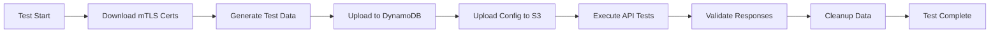

# Eligibility Signposting API - E2E Test Automation Framework

A comprehensive BDD-based test automation framework for the NHS Eligibility Signposting API using Behave, AWS integration, and mTLS authentication.

## 🚀 Quick Start Guide (5 Minutes)

### Prerequisites Check

Before starting, ensure you have:

- Python 3.13+ installed
- Poetry installed (`curl -sSL https://install.python-poetry.org | python3 -`)
- AWS CLI installed and configured
- Access to NHS test environment AWS account

### 1. Environment Setup

```bash
# Clone and navigate to the project
cd tests/e2e

# Install dependencies
poetry install

# Copy environment template
cp .env.example .env

# Edit .env with your credentials (see Environment Configuration section)
```

### 2. First Test Run

```bash
# Run all tests (includes automatic setup and cleanup)
cd tests/e2e
poetry run behave

# Run a single scenario for quick validation
poetry run behave features/eligibility_check/eligibility_check.feature --name="Eligibility check returns 2xx response for NHS number queries"
```

### 3. Success Indicators

✅ **Tests pass**: You should see scenarios marked as "passed"
✅ **AWS connectivity**: mTLS certificates downloaded from SSM
✅ **Data setup**: DynamoDB test data uploaded successfully
✅ **API responses**: 200 status codes with valid JSON responses

**If tests fail**, check the [Troubleshooting](#troubleshooting) section below.

---

## 📋 Framework Overview

This framework provides automated end-to-end testing for the NHS Eligibility Signposting API with the following capabilities:

### Key Features

- **BDD Testing**: Gherkin scenarios using Behave framework
- **AWS Integration**: Automated DynamoDB test data management and S3 configuration
- **mTLS Authentication**: Automatic certificate retrieval from AWS SSM Parameter Store
- **Dynamic Test Data**: Date-based variable resolution for realistic test scenarios
- **Automated Cleanup**: Configurable test data cleanup after execution

### Framework Architecture

```
tests/e2e/
├── features/                    # BDD test scenarios
│   ├── eligibility_check/       # Feature files
│   │   └── eligibility_check.feature
│   ├── steps/                   # Step definitions
│   │   ├── eligibility_check_steps.py
│   │   └── helpers/             # Utility classes
│   │       ├── dynamodb_data_generator.py
│   │       └── dynamodb_data_uploader.py
│   └── environment.py           # Behave environment hooks
├── data/                        # Test data files
│   ├── in/dynamoDB/            # DynamoDB test records
│   ├── responses/              # Expected API responses
│   ├── s3/                     # S3 configuration files
│   └── configs/                # Global configurations
├── utils/                       # Framework utilities
│   └── config.py               # Configuration and schemas
├── tests/                       # pytest-based tests (legacy)
├── .env.example                # Environment template
└── README.md                   # This file
```

### Test Data Flow



---

## ⚙️ Environment Configuration

### Required Environment Variables

Copy [`tests/e2e/.env.example`](.env.example) to [`tests/e2e/.env`](.env) and configure:

```bash
# AWS Configuration (REQUIRED)
AWS_REGION=eu-west-2
AWS_ACCESS_KEY_ID=your_aws_access_key
AWS_SECRET_ACCESS_KEY=your_aws_secret_key
AWS_SESSION_TOKEN=your_aws_session_token

# DynamoDB Configuration (REQUIRED)
DYNAMODB_TABLE_NAME=eligibilty_data_store

# S3 Configuration (OPTIONAL)
S3_BUCKET_NAME=your-bucket-name
S3_UPLOAD_DIR=qa/json
S3_JSON_SOURCE_DIR=./data/s3

# API Configuration (AUTOMATIC)
BASE_URL=https://test.eligibility-signposting-api.nhs.uk
API_GATEWAY_URL=https://test.eligibility-signposting-api.nhs.uk

# Test Configuration (OPTIONAL)
ABORT_ON_AWS_FAILURE=false
KEEP_SEED=false                 # Set to true to keep test data after tests
VALID_NHS_NUMBER=50000000004
INVALID_NHS_NUMBER=9876543210
```

### AWS Permissions Required

Your AWS credentials need the following permissions:

- **SSM**: `GetParameter` (for mTLS certificates)
- **DynamoDB**: `PutItem`, `DeleteItem`, `Scan` (for test data management)
- **S3**: `PutObject`, `DeleteObject` (optional, for configuration files)

---

## 🧪 Test Execution

### Running Tests

**Run all tests:**

```bash
poetry run behave
```

**Run specific feature:**

```bash
poetry run behave features/eligibility_check/eligibility_check.feature
```

**Run with specific tags (if configured):**

```bash
poetry run behave --tags=@smoke
```

**Debug mode with verbose output:**

```bash
poetry run behave --verbose --no-capture
```

### Test Data Management

The framework automatically manages test data:

1. **Data Generation**: [`dynamodb_data_generator.py`](features/steps/helpers/dynamodb_data_generator.py) processes JSON templates with date variables
2. **Data Upload**: [`dynamodb_data_uploader.py`](features/steps/helpers/dynamodb_data_uploader.py) handles DynamoDB operations
3. **Data Cleanup**: Automatic cleanup unless `KEEP_SEED=true`

**Manual data operations:**

```bash
# Keep test data after execution (useful for debugging)
export KEEP_SEED=true
poetry run behave

# Force cleanup (if previous tests left data)
export KEEP_SEED=false
poetry run behave
```

### Available Test Scenarios

Current test scenarios in [`eligibility_check.feature`](features/eligibility_check/eligibility_check.feature):

| NHS Number | Scenario                     | Expected Response                                             |
| ---------- | ---------------------------- | ------------------------------------------------------------- |
| 5000000001 | Standard eligibility check   | [`AUTO_RSV_SB_001.json`](data/responses/AUTO_RSV_SB_001.json) |
| 5000000002 | Alternative eligibility path | [`AUTO_RSV_SB_002.json`](data/responses/AUTO_RSV_SB_002.json) |
| ...        | ...                          | ...                                                           |
| 5000000014 | Complex eligibility scenario | [`AUTO_RSV_SB_014.json`](data/responses/AUTO_RSV_SB_014.json) |

---

## 🔧 Extending the Framework

### Adding New Test Scenarios

1. **Create test data files:**

   ```bash
   # Add DynamoDB record
   cp data/in/dynamoDB/AUTO_RSV_SB_001.json data/in/dynamoDB/AUTO_RSV_SB_015.json

   # Add expected response
   cp data/responses/AUTO_RSV_SB_001.json data/responses/AUTO_RSV_SB_015.json

   # Edit both files with new test data
   ```

2. **Update feature file:**

   ```gherkin
   # Add new row to Examples table in eligibility_check.feature
   | 5000000015 | AUTO_RSV_SB_015.json |
   ```

3. **Test your changes:**
   ```bash
   poetry run behave --name="5000000015"
   ```

### Adding New Features

1. **Create new feature file:**

   ```bash
   mkdir -p features/new_feature
   touch features/new_feature/new_feature.feature
   ```

2. **Create step definitions:**

   ```bash
   touch features/steps/new_feature_steps.py
   ```

3. **Use existing helpers or create new ones:**
   ```python
   from helpers.dynamodb_data_uploader import DynamoDBDataUploader
   from helpers.dynamodb_data_generator import JsonTestDataProcessor
   ```

### Dynamic Test Data Variables

The framework supports date-based variables in test data:

```json
{
  "LAST_SUCCESSFUL_DATE": "<<DATE_day_-30>>", // 30 days ago
  "NEXT_DUE_DATE": "<<DATE_day_+90>>", // 90 days from now
  "BIRTH_DATE": "<<DATE_year_-75>>" // 75 years ago
}
```

Supported formats:

- `<<DATE_day_±N>>` - Add/subtract N days
- `<<DATE_month_±N>>` - Add/subtract N months
- `<<DATE_year_±N>>` - Add/subtract N years
- `<<RANDOM_GUID>>` - Generate random GUID

---

## 🔐 mTLS Configuration

The framework automatically handles mTLS authentication:

### Certificate Management

- **Storage**: Certificates stored in AWS SSM Parameter Store
- **Retrieval**: Automatic download at test startup
- **Paths**:
  - Private Key: `/test/mtls/api_private_key_cert`
  - Client Cert: `/test/mtls/api_client_cert`
  - CA Cert: `/test/mtls/api_ca_cert`

### Certificate Setup (For DevOps)

```bash
# Store certificates in SSM (DevOps task)
aws ssm put-parameter \
  --name "/test/mtls/api_private_key_cert" \
  --value file://private_key.pem \
  --type SecureString

aws ssm put-parameter \
  --name "/test/mtls/api_client_cert" \
  --value file://client_cert.pem \
  --type SecureString

aws ssm put-parameter \
  --name "/test/mtls/api_ca_cert" \
  --value file://ca_cert.pem \
  --type SecureString
```

---

## 🐛 Troubleshooting

### Common Issues and Solutions

**❌ AWS Authentication Failed**

```bash
# Check AWS credentials
aws sts get-caller-identity

# Ensure you have the correct session token
export AWS_SESSION_TOKEN=your_session_token
```

**❌ DynamoDB Access Denied**

```bash
# Verify table name and permissions
aws dynamodb describe-table --table-name eligibilty_data_store
```

**❌ mTLS Certificate Download Failed**

```bash
# Check SSM parameters exist
aws ssm get-parameter --name "/test/mtls/api_private_key_cert"
```

**❌ API Connection Timeout**

```bash
# Check network connectivity
curl -I https://test.eligibility-signposting-api.nhs.uk/health
```

**❌ Test Data Upload Failed**

- Verify [`DYNAMODB_TABLE_NAME`](.env) matches actual table
- Check your AWS permissions include `dynamodb:PutItem`
- Ensure JSON files in [`data/in/dynamoDB/`](data/in/dynamoDB/) are valid

**❌ JSON Response Validation Failed**

- Check expected response files in [`data/responses/`](data/responses/)
- Verify NHS numbers match between test data and feature file
- Use `--no-capture` flag to see detailed diff output

### Debug Mode

```bash
# Run with maximum verbosity
poetry run behave --verbose --no-capture --no-capture-stderr

# Run single scenario with debug
poetry run behave features/eligibility_check/eligibility_check.feature:19 --verbose
```

### Logging

Framework logs are written to console. Key log messages:

- `✅ AWS credentials loaded`
- `✅ mTLS certificates downloaded`
- `✅ DynamoDB data uploaded: X items`
- `✅ Test scenario passed`

---

## 🔄 CI/CD Integration

### GitHub Actions Example

```yaml
name: E2E Tests
on: [push, pull_request]

jobs:
  e2e-tests:
    runs-on: ubuntu-latest
    steps:
      - uses: actions/checkout@v4

      - name: Set up Python
        uses: actions/setup-python@v4
        with:
          python-version: "3.13"

      - name: Install Poetry
        uses: snok/install-poetry@v1

      - name: Install dependencies
        run: |
          cd tests/e2e
          poetry install

      - name: Run E2E tests
        env:
          AWS_ACCESS_KEY_ID: ${{ secrets.AWS_ACCESS_KEY_ID }}
          AWS_SECRET_ACCESS_KEY: ${{ secrets.AWS_SECRET_ACCESS_KEY }}
          AWS_SESSION_TOKEN: ${{ secrets.AWS_SESSION_TOKEN }}
          AWS_REGION: eu-west-2
          DYNAMODB_TABLE_NAME: eligibilty_data_store
        run: |
          cd tests/e2e
          poetry run behave --junit --junit-directory reports/

      - name: Upload test results
        uses: actions/upload-artifact@v3
        if: always()
        with:
          name: test-results
          path: tests/e2e/reports/
```

---

## 📚 Additional Resources

### Framework Dependencies

- **[Behave](https://behave.readthedocs.io/)**: BDD framework for Python
- **[Boto3](https://boto3.amazonaws.com/v1/documentation/api/latest/index.html)**: AWS SDK for Python
- **[Requests](https://docs.python-requests.org/)**: HTTP library for API calls
- **[Python-dotenv](https://pypi.org/project/python-dotenv/)**: Environment variable management

### Related Documentation

- [NHS API Platform Documentation](https://digital.nhs.uk/developer/api-catalogue)
- [Eligibility Signposting API Specification](../../../specification/)
- [Main Project README](../../../README.md)

### File Structure Reference

```
tests/e2e/
├── 📁 features/
│   ├── 📁 eligibility_check/
│   │   └── 📄 eligibility_check.feature      # BDD scenarios
│   ├── 📁 steps/
│   │   ├── 📄 eligibility_check_steps.py     # Step implementations
│   │   └── 📁 helpers/
│   │       ├── 📄 dynamodb_data_generator.py # Test data processing
│   │       └── 📄 dynamodb_data_uploader.py  # AWS data operations
│   ├── 📄 environment.py                     # Behave hooks and setup
│   └── 📄 __init__.py
├── 📁 data/
│   ├── 📁 in/dynamoDB/                       # DynamoDB test records
│   │   ├── 📄 AUTO_RSV_SB_001.json
│   │   └── 📄 ... (014 test files)
│   ├── 📁 responses/                         # Expected API responses
│   │   ├── 📄 AUTO_RSV_SB_001.json
│   │   └── 📄 ... (014 response files)
│   ├── 📁 s3/                               # S3 configuration files
│   │   └── 📄 AUTO_RSV_SB_001.json
│   └── 📁 configs/                          # Global configurations
├── 📁 utils/
│   ├── 📄 config.py                         # Framework configuration
│   └── 📄 __init__.py
├── 📁 tests/                                # Legacy pytest tests
├── 📄 .env.example                          # Environment template
├── 📄 .gitignore                           # Git ignore rules
└── 📄 README.md                            # This documentation
```

---

## ❓ Support and Contribution

### Getting Help

1. **Check this README** for common issues and solutions
2. **Review logs** using `--verbose --no-capture` flags
3. **Validate environment** using the troubleshooting section
4. **Contact the team** if issues persist

### Contributing

1. **Follow existing patterns** when adding new tests
2. **Update documentation** when adding new features
3. **Test your changes** before submitting
4. **Keep test data minimal** and realistic

### Version History

- **v1.0**: Initial BDD framework with AWS integration
- **Current**: Comprehensive mTLS authentication and data management

---

_Last Updated: July 2025_
_Framework Version: 1.0_
_Maintained by: NHS Digital QA Team_
